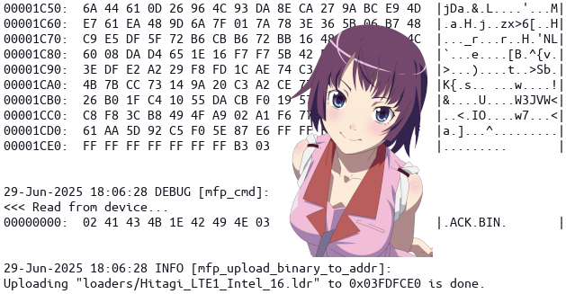

Hitagi
======

Open-source RAMDLD (RAM DownLoader) implementation of the Motorola Flash Protocol for Motorola phones.



## Build

```bash
sudo apt install -y gcc-arm-none-eabi

./build.sh

# Alt.
make PLATFORM=LTE1 FLASH_TYPE=intel16
make PLATFORM=LTE2 FLASH_TYPE=intel16
make PLATFORM=LTE1C FLASH_TYPE=intel16
make PLATFORM=LTE2C FLASH_TYPE=intel16
make PLATFORM=LTE1 FLASH_TYPE=amd16
```

## Run

Please use the **Flash Terminal** utility: **[https://github.com/EXL/FlashTerminal](https://github.com/EXL/FlashTerminal)** for uploading and running RAMDLDs.

```bash
sudo ./FlashTerminal.py -v -l
```

## Notes

1. Command list of implemented Motorola Flash Protocol.

   ```bash
   ADDR        |.ADDR.10000000XX.       |  # Set address for BIN command, XX is checksum.
   BIN         |.BIN.DATAXX.            |  # Upload binary to address (IRAM, RAM, Flash for flashing), XX is checksum.
   ERASE       |.ERASE.                 |  # Activate read and write mode. See below for more details.
   READ        |.READ.10000000,0200.    |  # Read data from address on size.
   RQHW        |.RQHW.                  |  # Request hardware info data, bootloader version.
   RQRC        |.RQRC.10000000,10000600.|  # Calculate checksum of addresses range.
   RQVN        |.RQVN.                  |  # Request version info.
   RQSW        |.RQSW.                  |  # Request S/W version.
   RQSN        |.RQSN.                  |  # Request serial number of SoC.
   RQFI        |.RQFI.                  |  # Request part ID from flash memory chip.
   READ_OTP    |.READ_OTP.              |  # Read OTP registers data.
   RESTART     |.RESTART.               |  # Restart or power down device.
   POWER_DOWN  |.POWER_DOWN.            |  # Power off device.
   ```

2. Flash modes can be switched by calling the method that sets the `ERASE` flag a different number of times.

   ```python
   # 0. Read-only mode. No `ERASE` flag is set.
   
   # 1. Read/Write word mode for the entire flash.
   mfp_cmd(er, ew, 'ERASE')
   
   # 2. Read/Write buffer mode for the entire flash.
   mfp_cmd(er, ew, 'ERASE')
   mfp_cmd(er, ew, 'ERASE')
   
   # 3. Erase-only mode for the entire flash.
   mfp_cmd(er, ew, 'ERASE')
   mfp_cmd(er, ew, 'ERASE')
   mfp_cmd(er, ew, 'ERASE')
   ```

3. It is better if the flashed chunk size is a multiple of `0x8000` (parameter blocks) or `0x20000` (main blocks) for Intel-like and AMD-like flash chips.

## Credits & Thanks

* **[@muromec](https://github.com/muromec)**
* **[@EXL](https://github.com/EXL)**
* **[@Siesta](https://github.com/Siesta)** aka fkcoder, LAVMEN
* **[@Vilko](https://github.com/Vilko)**
* GanjaFuzz
* KAMTOS
* Oleg aka velocidad_absurda and MSS Box II developers
* P2K Easy Tool authors
* MotoFan.Ru developers
* Motorola developers and engineers
* Intel and AMD engineers and other
* DenK and ahsim for testing Spansion memory chip flashing on Siemens CC75
